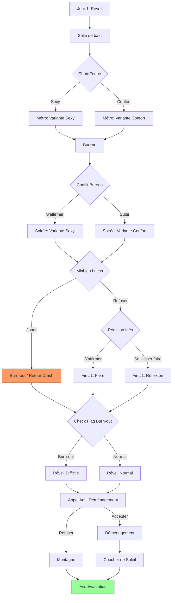

# Hypersensitivity
### An Interactive Audio Journey into Sensory Perception

**Hypersensitivity** is an immersive web experience designed to simulate the daily life of someone living with auditory hypersensitivity. Through a combination of interactive storytelling, reactive audio, and fluid visuals, this project invites users to step into a world where every sound matters.

## 🎧 The Experience

This project is more than just a website; it's a narrative game where you navigate a day in the life of a hypersensitive individual.

- **Immersive Audio:** Best experienced with headphones. The sound design plays a crucial role in conveying the feeling of sensory overload or relief.
- **Interactive Narrative:** Make choices that impact your energy levels and relationships. Every decision counts.
- **Reactive Visuals:** Experience a "breathing" interface with GSAP animations and smooth scrolling that mirrors the protagonist's internal state.
- **Real Testimonies:** Listen to authentic stories from individuals who live with hypersensitivity.

## 🚀 Getting Started

Follow these instructions to set up the project locally for development or exploration.

### Prerequisites

- [Node.js](https://nodejs.org/) (Latest LTS recommended)
- [pnpm](https://pnpm.io/) (Preferred package manager)

### Installation

1.  **Clone the repository:**
    ```bash
    git clone https://github.com/your-username/hypersensitivity-v2.git
    cd hypersensitivity-v2
    ```

2.  **Install dependencies:**
    ```bash
    pnpm install
    ```

### Development Server

Start the development server with hot-reload:

```bash
pnpm dev
```

Visit `http://localhost:3000` to begin the experience.

### Production Build

To build the application for production:

```bash
pnpm build
```

To preview the production build locally:

```bash
pnpm preview
```

## 🎮 Game Flow

This diagram illustrates the narrative structure and the different branches of the experience:



## 🛠️ Built With

This project utilizes a modern tech stack to deliver high-performance animations and seamless audio integration.

- **[Nuxt 4](https://nuxt.com/)** - The Intuitive Vue Framework
- **[Vue 3](https://vuejs.org/)** - Progressive JavaScript Framework
- **[Tailwind CSS v4](https://tailwindcss.com/)** - With `fluid-tailwindcss` for responsive scaling
- **[GSAP](https://greensock.com/gsap/)** - Professional-grade animation library
- **[Lenis](https://lenis.darkroom.engineering/)** - Smooth scrolling
- **[Pinia](https://pinia.vuejs.org/)** - Intuitive state management

## 📄 License

[MIT](LICENSE)