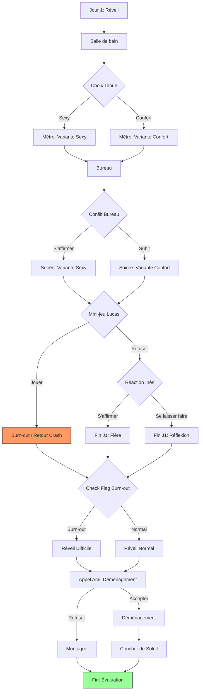

# Game Architecture & Workflow

This document provides a technical overview of the Hypersensitivity game engine, scene structure, routing logic, and content workflow.

## 🏗️ Game Engine

The game is built on **Nuxt 4** and uses **Pinia** for state management. The core game logic is **data-driven**, meaning the entire narrative structure is defined in TypeScript data files rather than hardcoded in components.

### Core Components

- **`GameStore` (`app/stores/game.ts`)**: Manages the current state (current scene, flags, energy, history). It handles the logic for transitioning between scenes and applying side effects (energy changes, flag updates).
- **`GameData` (`app/data/game.ts`)**: The central registry for all game content. It defines:
  - `initialSceneId`: Where the game starts.
  - `initialFlags`: Default state of game variables.
  - `milestones`: Key progress points for the UI.
  - `scenes`: A map of all `Scene` objects, indexed by ID.

## 🧩 Composable Architecture

This project uses a layered composable architecture so game rules, UI orchestration, and animation timing can evolve independently.

### Game Mechanic Composables

#### 1. Orchestration Layer (GameContainer-facing)

- **`useGameController`** (`app/composables/game/useGameController.ts`)
  - Thin facade consumed by `GameContainer.vue`.
  - Wires all sub-composables and exposes a stable API to the component.
- **`useGameUiVisibility`** (`app/composables/game/useGameUiVisibility.ts`)
  - Computes visibility state (`showGameUI`, `showDelayedGameUI`, annotation/content visibility).
  - Handles delayed UI reveal during day transitions.
  - Handles menu opening transition timing.
- **`useGameInteractions`** (`app/composables/game/useGameInteractions.ts`)
  - Handles click-to-advance behavior and choice selection callbacks.
  - Handles end-of-dialogue animation callback logic.
- **`useChoicePresentation`** (`app/composables/game/useChoicePresentation.ts`)
  - Maintains displayed choices (`activeChoices`).
  - Applies GSAP entrance animation for the choice block.

#### 2. Dialogue Layer

- **`useDialogueBox`** (`app/composables/game/useDialogueBox.ts`)
  - Integration point used by `DialogueBox.vue`.
  - Coordinates split text readiness, animation triggers, and cleanup.
- **`useDialogueDisplay`** (`app/composables/game/useDialogueDisplay.ts`)
  - Pure display rules: alignment, annotation visibility, intro phase display logic.
- **`useDialogueAudio`** (`app/composables/game/useDialogueAudio.ts`)
  - Audio lifecycle helpers (play/ensure current track, fallback timer, on ended).
- **`useDialogueAnimation`** (`app/composables/game/useDialogueAnimation.ts`)
  - Builds and controls GSAP timelines for timed words/annotations.
  - Syncs timeline position with current audio.
- **`useDialogueAudioSync`** (`app/composables/game/useDialogueAudioSync.ts`)
  - Advances shared-scene dialogues based on global audio cursor.
- **`useDialogueAurora`** (`app/composables/game/useDialogueAurora.ts`)
  - Applies aurora visual reactions to dialogue-level cues.

#### 3. Intro / Experience Layer

- **`useExperienceAnimation`** (`app/composables/game/useExperienceAnimation.ts`)
  - Aggregates eye animation + intro sequence API for `Experience.vue`.
- **`useIntroSequenceAnimation`** (`app/composables/game/useIntroSequenceAnimation.ts`)
  - Master intro timeline (text, gradient, eye morph).
  - Audio catch-up gating before reveal phase.
  - Auto-scroll trigger when user falls behind audio.
- **`useEyeAnimation`** (`app/composables/game/useEyeAnimation.ts`)
  - Day transition eye close/open sequences.
- **`useExperienceGradient`** (`app/composables/game/useExperienceGradient.ts`)
  - Computes background gradient and game-end transition state.
- **`useExperienceDayTransition`** (`app/composables/game/useExperienceDayTransition.ts`)
  - Coordinates Day 1 -> Day 2 visual and state transition.

#### 4. Shared Pure Rules (Testable)

- **`orchestration.ts`** (`app/composables/game/orchestration.ts`)
  - Pure helpers extracted from animation/orchestration logic.
  - Examples:
    - Cursor variant by intro progress.
    - Auto-scroll trigger predicate.
    - Audio path normalization/equivalence.
    - Timing-end resolution strategy.
- These helpers are covered by **`tests/orchestration-composables.test.mjs`**.

### Quiz (HSP) Composables (Independent Module)

The quiz is not part of game scene routing or milestone progression.

- It is mounted as an overlay in `app/app.vue` when `gameStore.showQuestionnaire` is `true`.
- It is entered from the game through explicit UI actions (end-of-experience prompt in `app/components/Experience.vue`, and menu shortcut in `app/components/game/GameMilestoneMenu.vue`).
- Quiz scoring/state lives in `hspQuiz` store and does not mutate narrative game progression.

#### 1. Container & Store

- **`HSPQuestionnaire.vue`** (`app/components/HSPQuestionnaire.vue`)
  - Screen-level container and view switcher (`intro` -> `quiz` -> `results`).
  - Reads/writes quiz state via `useHspQuizStore`.
- **`hspQuiz` store** (`app/stores/hspQuiz.ts`)
  - Single source of truth for questions, answers, scoring, section aggregation, and profile mapping.

#### 2. Animation Composables

- **`useHSPIntroAnimation`** (`app/composables/hsp/useHSPIntroAnimation.ts`)
  - Intro screen enter/leave transitions.
- **`useHSPQuizAnimation`** (`app/composables/hsp/useHSPQuizAnimation.ts`)
  - Quiz screen timeline orchestration.
  - Handles question transition direction, optional answer block animation changes, and enter/leave hooks.
- **`useHSPResultsAnimation`** (`app/composables/hsp/useHSPResultsAnimation.ts`)
  - Results reveal timeline.
  - Animates total score counter, per-section bars, and per-section counters.

#### 3. Typed UI Boundaries

- **`HSPQuiz.vue`** and **`HSPResults.vue`** use typed `defineProps` / `defineEmits` boundaries.
- This keeps contracts explicit between the store-driven container and animation composables.

### Execution Flow (High-Level)

1. `GameContainer.vue` consumes `useGameController()`.
2. `useGameController()` delegates to visibility, interaction, and choice presentation composables.
3. `DialogueBox.vue` consumes `useDialogueBox()`, which coordinates display + audio + animation sublayers.
4. Intro and day transitions are orchestrated by `Experience.vue` through `useExperienceAnimation()`, `useExperienceGradient()`, and `useExperienceDayTransition()`.
5. Quiz flow is container-driven (`HSPQuestionnaire.vue`) and animation hooks are delegated to `useHSP*Animation` composables.
6. The quiz remains decoupled from scene progression: the bridge with game flow is only questionnaire visibility (`gameStore.showQuestionnaire`).

### Extension Guidelines

- Add new game UI state rules in `useGameUiVisibility` before touching components.
- Add new interaction rules in `useGameInteractions` (not directly in `GameContainer.vue`).
- Keep timeline predicates and path/timing rules pure in `orchestration.ts` when possible, then test them in `tests/orchestration-composables.test.mjs`.
- Keep `useGameController` as a composition facade, not a logic-heavy module.
- Keep quiz business logic in `hspQuiz` composables/store; only use the visibility bridge (`showQuestionnaire`) to connect from game UI.

## 📂 Scene Structure

Scenes are modularized by day and activity to maintain code readability.

```
app/data/scenes/
├── day1/
│   ├── index.ts        # Exports all Day 1 scenes
│   ├── wakeup.ts       # Morning scenes
│   ├── metro.ts        # Commute scenes
│   ├── office.ts       # Work scenes
│   └── ...
├── day2/
│   ├── index.ts        # Exports all Day 2 scenes
│   └── ...
└── routing.ts          # Cross-day or special transitional scenes
```

Each `Scene` object follows the `Scene` type and typically includes:

- **`id`**: Unique identifier (from `SCENE_IDS`).
- **`audio`**: Path to the audio file for this scene.
- **`dialogues`**: Array of dialogue lines. Audio timings are tracked automatically via `app/data/timings/scenes.json`.
- **Routing Logic**: Instructions on where to go next (see below).

## 🔀 Routing Logic

The engine supports three types of transitions:

1.  **Direct Transition (`nextSceneId`)**:
    - The most common flow. After the current scene's audio/dialogue finishes, the game automatically moves to this ID.
2.  **Player Choices (`choices`)**:
    - Presents buttons to the user.
    - Each choice has a `nextSceneId` and optional `effects` (e.g., modifying energy or setting flags).
3.  **Milestone-Driven Navigation (`goToNextScene`)**:
    - If no explicit routing is defined (`nextSceneId` or `choices`), the engine follows the natural order of scenes within the current **Milestone**.
    - When the last scene of a milestone is reached, the game automatically transitions to the first valid scene of the next milestone in `MILESTONE_ORDER`.

## 🏁 Milestone-Driven Navigation

Milestones serve as both "chapters" in the narrative and "checkpoints" for the navigation menu.

### Definition (`app/data/milestones.ts`)

A milestone group together several scenes that logically belong to the same narrative arc:

```ts
export const MILESTONES: Record<string, MilestoneDef> = {
  reveil: {
    id: "reveil",
    label: "Réveil",
    day: 1,
    scenes: [SCENE_IDS.DAY_ONE_WAKEUP, SCENE_IDS.DAY_ONE_BATHROOM, ...],
  },
  // ...
};
```

### The "Playlist" Logic

The engine uses a "playlist" approach implemented in `stores/game.ts`:

- **`goToNextScene()`**:
  1. Looks for the current scene in the current milestone's `scenes` array.
  2. Moves to the next valid scene (checking `condition` and `conditions`).
  3. If no more scenes are found, it identifies the next milestone via `MILESTONE_ORDER` and moves to its first valid scene.
- **`goToMilestone(id)`**:
  - Used by the navigation menu. It jumps to the first valid scene of the specified milestone.
  - Only "reached" milestones (stored in `reachedMilestones`) are accessible in the UI.

### Progress Tracking

As the player advances, reached milestones are added to the `reachedMilestones` state. This persists across sessions and allows the player to jump back to key moments via the **GameMilestoneMenu**.

## 🗣️ Audio & Dialogue Workflow

We use **ElevenLabs** for voice generation and transcription. To streamline the integration of these assets into the game, a custom script is available.

### Import Script

The `scripts/import-dialogues.js` script transforms the JSON output from ElevenLabs (which contains word-level timestamps) into the TypeScript format required by the game engine.

**Usage:**

```bash
node scripts/import-dialogues.js <path_to_json> <base_id> <start_index> <pensees_indices>
```

- **`path_to_json`**: Path to the ElevenLabs transcript JSON.
- **`base_id`**: Prefix for the dialogue IDs (e.g., `d1` for Day 1).
- **`start_index`**: Starting number for the dialogue IDs.
- **`pensees_indices`**: Comma-separated list of indices (0-based) that identify "internal thoughts" (pensees) vs spoken dialogue.

**Example:**

```bash
node scripts/import-dialogues.js public/audios/experience/J01_S03.json d1 24 "0,3,5"
```

This will output the formatted `d(...)` and `pensees(...)` code blocks to the console, which can then be directly copied into a scene file.

## 🎮 Game Flow

This diagram illustrates the narrative structure and the different branches of the experience:


