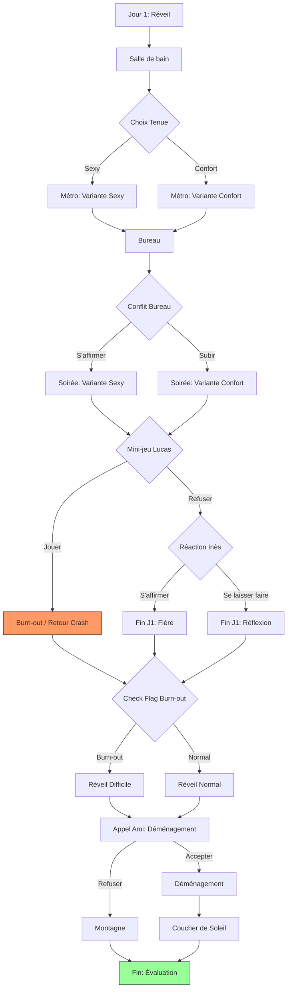

# Game Architecture & Workflow

This document provides a technical overview of the Hypersensitivity game engine, scene structure, routing logic, and content workflow.

## 🏗️ Game Engine

The game is built on **Nuxt 4** and uses **Pinia** for state management. The core game logic is **data-driven**, meaning the entire narrative structure is defined in TypeScript data files rather than hardcoded in components.

### Core Components

- **`GameStore` (`app/stores/game.ts`)**: Manages the current state (current scene, flags, energy, history). It handles the logic for transitioning between scenes and applying side effects (energy changes, flag updates).
- **`GameData` (`app/data/game.ts`)**: The central registry for all game content. It defines:
    - `initialSceneId`: Where the game starts.
    - `initialFlags`: Default state of game variables.
    - `milestones`: Key progress points for the UI.
    - `scenes`: A map of all `Scene` objects, indexed by ID.

## 📂 Scene Structure

Scenes are modularized by day and activity to maintain code readability.

```
app/data/scenes/
├── day1/
│   ├── index.ts        # Exports all Day 1 scenes
│   ├── wakeup.ts       # Morning scenes
│   ├── metro.ts        # Commute scenes
│   ├── office.ts       # Work scenes
│   └── ...
├── day2/
│   ├── index.ts        # Exports all Day 2 scenes
│   └── ...
└── routing.ts          # Cross-day or special transitional scenes
```

Each `Scene` object implements the `Scene` interface and typically includes:
- **`id`**: Unique identifier (from `SCENE_IDS`).
- **`audio`**: Path to the audio file for this scene.
- **`dialogues`**: Array of dialogue lines with precise timings.
- **Routing Logic**: Instructions on where to go next (see below).

## 🔀 Routing Logic

The engine supports three types of transitions:

1.  **Direct Transition (`nextSceneId`)**:
    - The most common flow. After the current scene's audio/dialogue finishes, the game automatically moves to this ID.
    
2.  **Player Choices (`choices`)**:
    - Presents buttons to the user.
    - Each choice has a `nextSceneId` and optional `effects` (e.g., modifying energy or setting flags).
    
3.  **Conditional Auto-Routing (`autoChoice`)**:
    - Used for branching paths based on previous decisions (flags) without user intervention.
    - Checks a `flag`, `operator` (equals), and `value`.
    - Routes to `thenSceneId` if true, `elseSceneId` if false.

## 🗣️ Audio & Dialogue Workflow

We use **ElevenLabs** for voice generation and transcription. To streamline the integration of these assets into the game, a custom script is available.

### Import Script

The `scripts/import-dialogues.js` script transforms the JSON output from ElevenLabs (which contains word-level timestamps) into the TypeScript format required by the game engine.

**Usage:**

```bash
node scripts/import-dialogues.js <path_to_json> <base_id> <start_index> <pensees_indices>
```

- **`path_to_json`**: Path to the ElevenLabs transcript JSON.
- **`base_id`**: Prefix for the dialogue IDs (e.g., `d1` for Day 1).
- **`start_index`**: Starting number for the dialogue IDs.
- **`pensees_indices`**: Comma-separated list of indices (0-based) that identify "internal thoughts" (pensees) vs spoken dialogue.

**Example:**

```bash
node scripts/import-dialogues.js public/audios/experience/J01_S03.json d1 24 "0,3,5"
```

This will output the formatted `d(...)` and `pensees(...)` code blocks to the console, which can then be directly copied into a scene file.

## 🎮 Game Flow

This diagram illustrates the narrative structure and the different branches of the experience:


